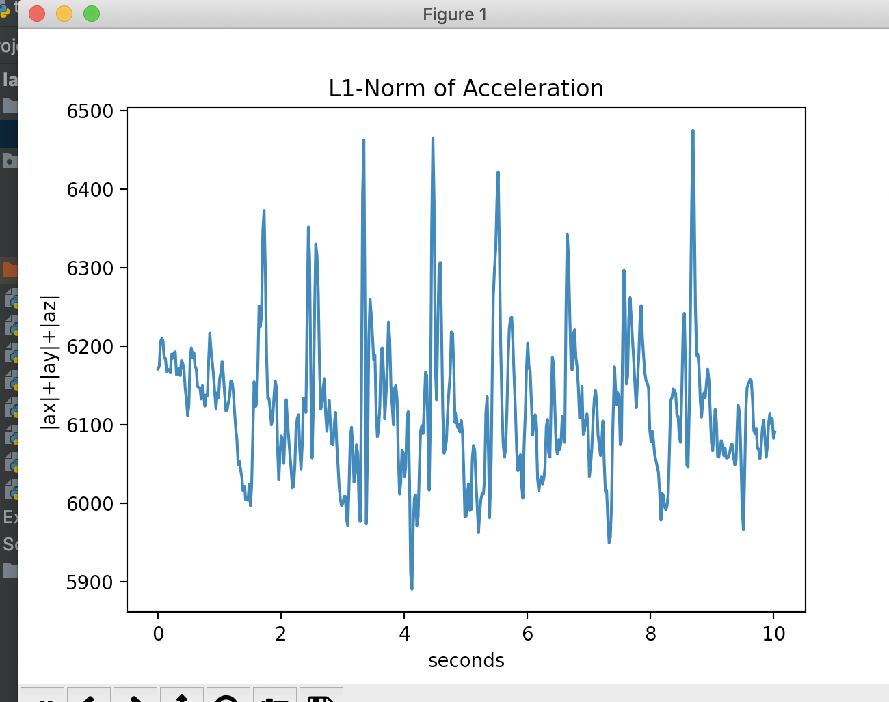
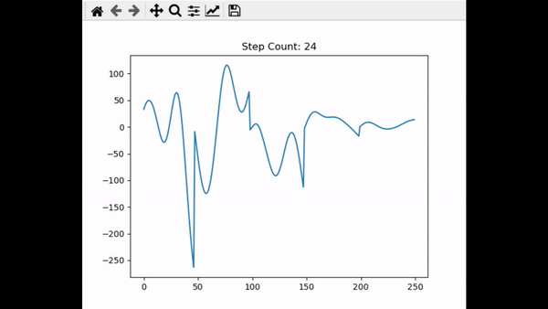
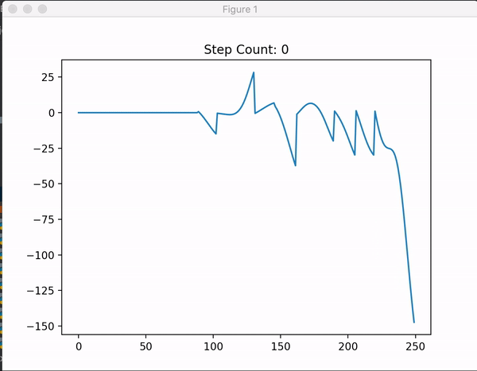
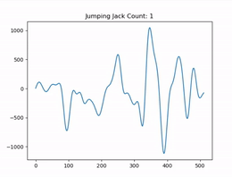

# Lab 5

# Tutorial 1:
For tutorial1, we learned how to stream data from the MCU to Python and to save it into a file (accelerometer.csv).
Below is the signal that we plotted with the data coming from the MCU.  
 
# Tutorial 2:
For tutorial2, we got introduced to ways that we can filter our signal : low pass, butterworth, gradient, moving average, detrending , ...
 

# Tutorial 3:
Here, we used a Pedometer class to compute the numbers of steps taken both offline and online. 

# Challenge 1:

For Challenge1, we were required to record our steps and display 
the number of steps on the OLED. To do so, we filtered our signal by 
computing the l1 norm, detrending the l1 and passing it through a low pass filter that filtered out frequencies greater than 1.7. In addition to that, we also defined our thresholds to be low_threshold = 25 and high_threshold = 150.
We also tried to implement the filtering steps that were laid out in the write-up, but we achieved similar results by only detrending the signal and passing it through a low pass filter.

l1 -> dt of l1 -> lp of dt -> counting peaks

Brenner's Data | Maria's Data 
------------ | -----------
 | 

https://www.youtube.com/watch?v=LJHF1fYdlSY

# Challenge 2 
For Challenge2, we were required to record our jumping jacks in the MCU, but 
to only send the data to Python when the button is pressed. 
Our biggest challenge was to create a data buffer inside the Arduino file by storing 
the data inside a large array and getting rid of old data when the buffer gets full. 

