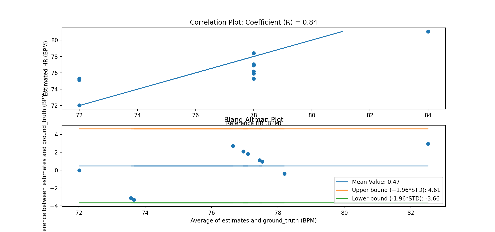
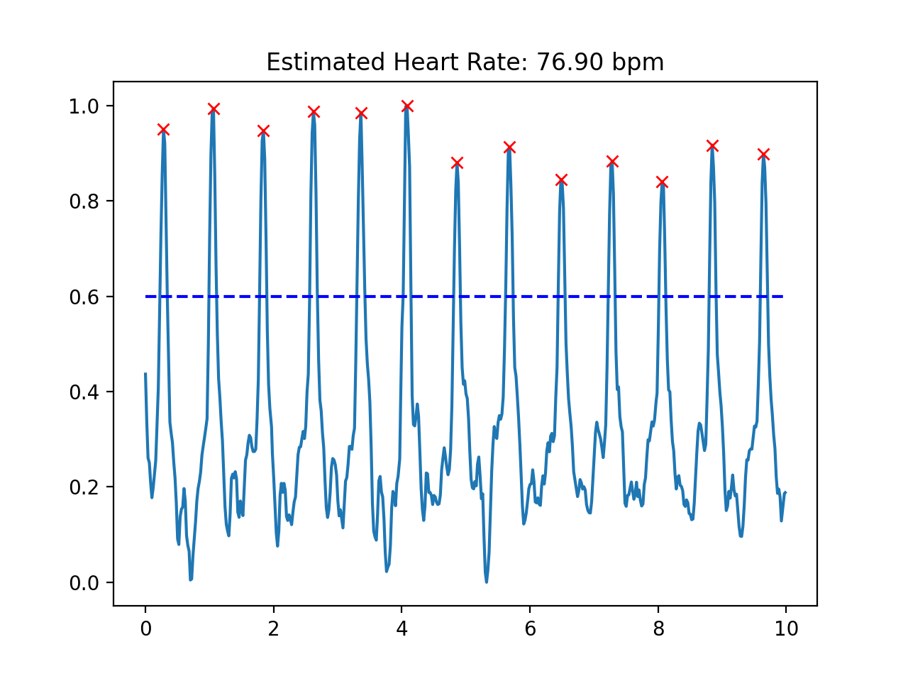

#Lab 6
### For this lab, we were asked to implement a heart monitor using a specific algorythm to compute the heart rate. 
###To get the heart beat signal we used a device that detected the reflection of light on our finger; the reflection was an inversed signal of our blood vessels going through diastole and sistole.  

###Tutorial 1 

Here, we learned how to use a photoplethysmography to get a signal that captures volumetric blood changes. 
We got to plot the signal in both the MCU and pycharm. 

1)Note that you can connect both the heartbeat sensor and your OLED at the same time, 
both of which use the I2C, SDA, and SCL lines. Why does this work?

The heartbeat sensor and OLED have different addresses that correspond to them. When their information is sent to the MCU or information is sent by the MCU to the sensor, they are addressed first in the I2C. To stop any overlapping data signals, SCL allows each component to know when the SDA line is being used and waits until it's finished.

2)Notice the while(1) statement. What happens if the device is not 
connected? What happens if the error is printed and then you connect 
the device? Will the code proceed? Try it and describe the behavior.

When the device is not connected an error message gets printed out in Serial Plotter. When the device is connected, Serial Plotter proceeds to plot the signal

3)What would the settings look like if you were to: set the led brightness to 25mA, use only the Red + IR LEDs, sample at 200Hz, and use an ADC range of 8192? 

byteledBrightness = 127; //Options: 0=Off to 255=50mA
bytesampleAverage = 8; //Options: 1, 2, 4, 8, 16, 32
byteledMode = 2; //Options: 1 = Red only, 2 = Red+IR, 3 = Red+IR+Green
int sampleRate = 200; //Options: 50, 100, 200, 400, 800, 1000, 1600, 3200
int pulseWidth = 411; //Options: 69, 118, 215, 411
int adcRange = 8192; //Options: 2048, 4096, 8192, 16384

4)What are the units of the pulse width? Would the bigger pulse width result in a more intense or less intense measurement (intensity refers to the intensity of light)? Why?

The units are µs. A bigger pulse results in a more intense measurement. That happens because setting the pulse width value determines the number of duty cycles, so the higher the duty cycle, the higher the intensity. 

5)How many bits are needed for an ADC range of 16384?
 18 bits
 
6) What is the peak wavelength of the R, IR, and G LEDs?
IR (min = 870nm, max = 900nm); R (min = 650nm, max = 670nm); G (min = 530nm, max = 545nm)
   
7)If you want to read the green value, what ledMode do you need to 
set and what function will you need to use to get the green signal (HINT: it is not getIR()!)?

Set ledMode = 3 and use the function "getGreen()"
### Tutorial 2

Here, we learned how to create an efficient algorythm to filter a ppg signal. By filtering, we wished to make it easier for us to detect the heart beats and compute the heart rate. 
At the end, we created a class called HRMonitor that filtered the signal and that computed the number of peaks and the heart rate. 

### Tutorial 3

Here, we saved 10 samples of our heart beats. We created the tutorial_ml_data to collect our samples and to the save all the data inside 10 files. 

### Challenge 1

We created the file challenge1_hr_monitor.py that plotted the Correlation Plot and the Blant-Altman Plot. 
The correlation coefficient(0.84) reveals that the estimated heart rate was very close to the ground_truth. 
Looking at the Bland-Altman plot, we see that on average the estimated and ground truth data differs by only 0.47. I didn't, however, used samples that had very different heart rate. I'm assuming that to get a clearer idea of how good my algorythm is I would need samples that differed a lot from each other. 

When running sample 1 through the HRMonitor class, I got an estimated heart rate equal to 76.90bpm and 13 peaks detected. Originally, I counted 13 peaks which amounts to a heart rate equal to 78bpm. I assumed that it didn't exactly match the heart rate expected because when computing the heart rate inside the HRMonitor class we didn't simply multiply the number of peaks by 6, instead we divided 60 by the mean of the sample difference of the times a peak appeared.

### Challenge 2

We were asked to display our heart rate on the OLED. I ran into some issues with the OLED displaying "nan". I tried to fix it by only allowing data to be streamed when the peaks are not zero, but it didn't seem to work. But overall, this issue was minimal and the heart rate was displayed as expected.

URL for video : https://www.youtube.com/watch?v=rrUfzZanfy8

### Challenge 3
In this challenge, we learned how to use open-cv to record a video and to use it to record heart beat signals.
First, we were asked to record a video with canny edge detection

Unfortunately, my heart monitor using open-cv was displaying negative values that I don't know how to get rid of. 

