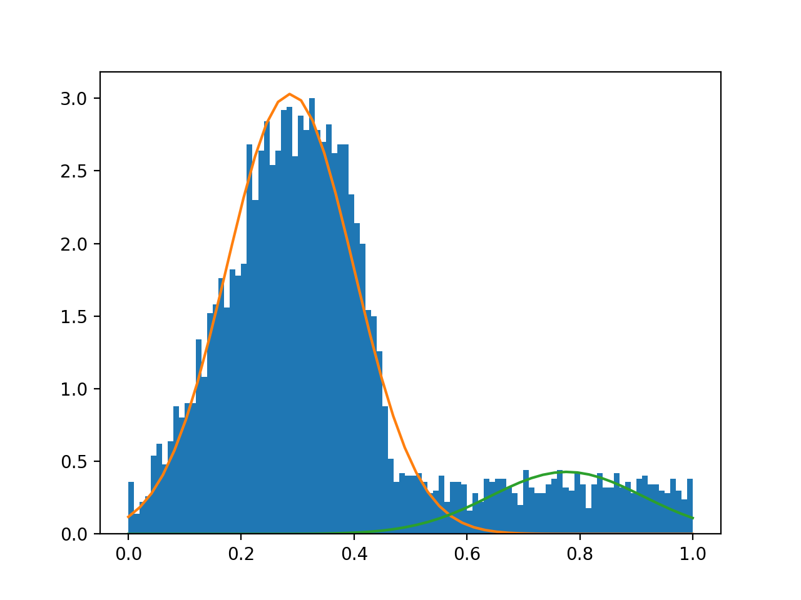
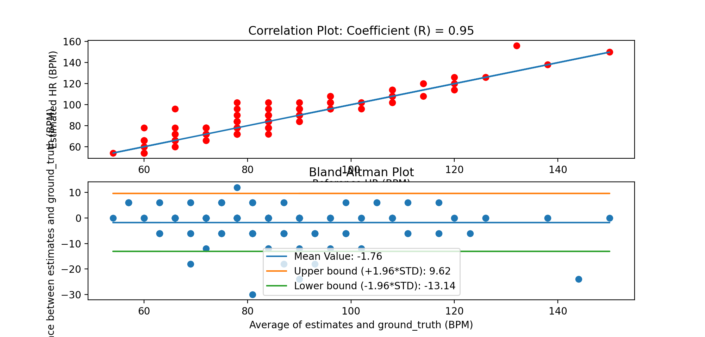
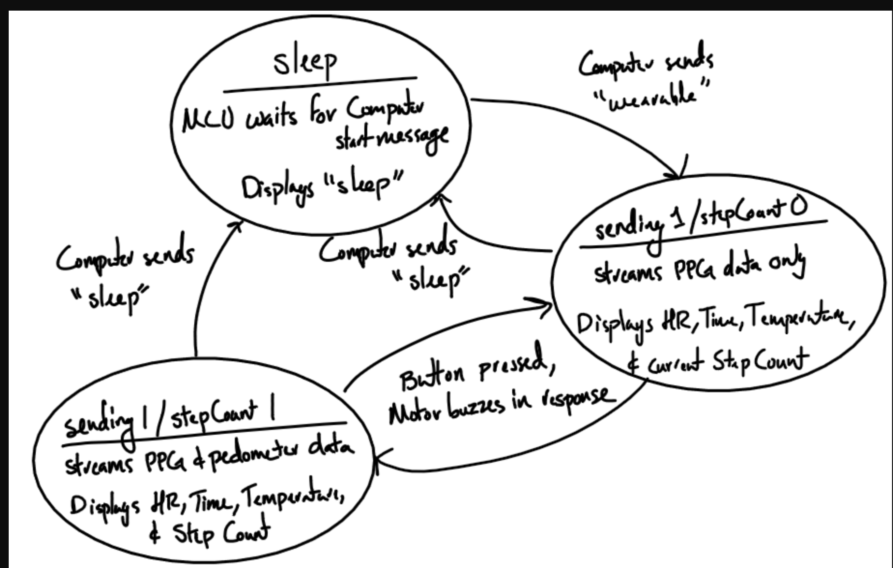

#Lab 7

### One of the objective of this lab was to implement a HR monitor by using Machine Learning. The second objective was to build a wearable with all the classes that we created in previous labs. 

For tutorial 1
 
We created a file called "tutorial_ml_data_prep.py". Inside this file, we defined 4 functions
get_subjects, get_data, get_hr and est_fs. 
get_subjects retrieves a list with the subjects, 
get_data verifies if the file has bad data, gets the ppg signal and the reported heart rate.

For tutorial 2

We created two files : tutorial_gmm.py and tutorial_gmm_losov

tutorial_gmm_py
We learned and used the scikit-learn library to train and predict the heartrate of our PPG data with a Gaussian Mixture model. In this case, we train our model on a single subjects' and predicted on the same subject data. 

We plotted the gaussian with a histogram of the data, showing how the gaussian fitted the data:

tutorial_gmm_losov.py

Here, we performed Leave-One-Subject-Out-Validation which entailed training the data of all subjects except for one, then we tested the predicted label on the excluded subject. 

### Challenge 1
Here, we performed Leave-One-Subject-Out-Validation from Tutorial 2 for every subject. Then, we put inside one array the ground_truth heartrate and in another array, the estimated heartrate.
Using these values, we plotted ground_truth x estimate and computed the RMSE. 

Inside get_data, I implemented code that skipped samples with bad sampling rates and I additionally skipped 2 samples whose ground_truth values deviated a lot from the estimated (in comparison to other samples).

Below, at the top, is the ground_truth x estimated plot. Our RMSE for all validation sets combined came out to be  6.0659. 

The results demonstrate :
Correlation coefficcient = 0.95 (it tells us how related our estimated heartrate is to the ground truth; the closer it gets to a 1, the better, so that means that we got an ideal correlation coefficient )

standard deviation is 6.042 

bias  = -2.4198 ( Bias is a quantitative term describing the difference between the average of measurements made on the same object and its true value; the small bias that we see computed reveals that our results are not that biased )

The Band Altman plot is at the bottom:

## Challenge 2 
Here, we used the samples collected to train the data (using Gaussian mixture training) then we predicted the labels that we would use to get the estimated heart rate. The labels were used to estimate the heartrate of live data coming from the MCU.
Inside the HRMonitor class, we created two methods: train() and predict(). 

Video of the OLED displaying the heart rate of live streaming data.

https://www.youtube.com/watch?v=DSJhoiBDhP4

## Challenge 3

We created a wearable that displayed the current time, date, temperature, estimate the user's heartrate, and counted the steps. A functionality we added was the ability to start and stop the Pedometer at any time with a button press. The motor will buzz whenever the button is pressed down. 
Below is the state machine:
 

The URL  for the functioning wearable:
https://www.youtube.com/watch?v=7tjyxC_AjAc

